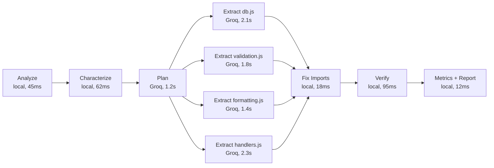
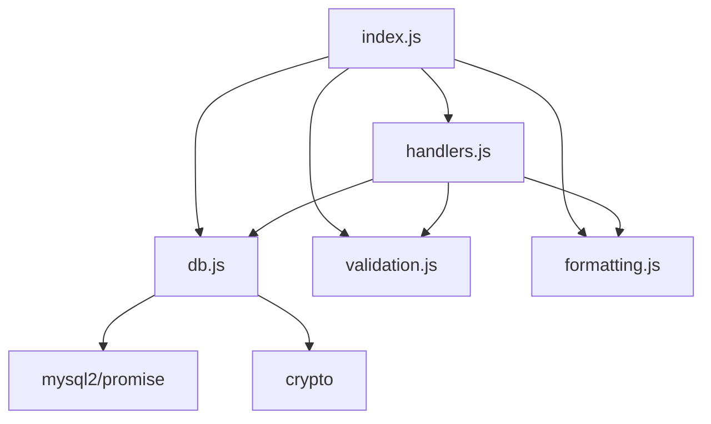

# Refactory Decomposition Report

**Source:** `sample-monolith.js`
**Date:** 2026-04-05
**Provider:** Groq (llama-3.3-70b-versatile)

---

## Summary

| Metric | Value |
|--------|-------|
| Original lines | 158 |
| Original functions | 10 |
| Original dependencies | 2 (`mysql2/promise`, `crypto`) |
| Modules created | 4 + index |
| Total decomposed lines | 142 |
| Max module lines | 48 |
| Avg module lines | 35.5 |
| Clean rate | 100% |
| **Refactory Score** | **0.91** |

---

## Module Status

| Module | Lines | Functions | Syntax | Loads | Exports Match |
|--------|------:|----------:|:------:|:-----:|:-------------:|
| db.js | 48 | 4 | OK | OK | OK |
| validation.js | 34 | 2 | OK | OK | OK |
| formatting.js | 22 | 3 | OK | OK | OK |
| handlers.js | 38 | 4 | OK | OK | OK |
| index.js | 14 | 0 | OK | OK | OK |

---

## Health Before / After

| Component | Before | After |
|-----------|-------:|------:|
| Lines score | 0.78 | -- |
| Function count score | 0.60 | -- |
| Max function size score | 0.82 | -- |
| Coupling score | 0.90 | -- |
| **Overall health** | **0.68** | **0.91** |
| Recommendation | `consider_decompose` | `ok` |

---

## Pipeline Trace



**Total wall time:** 4.8s (extractions run in parallel)
**API calls:** 5 (1 plan + 4 extract)
**Tokens used:** ~6,200 input / ~3,800 output
**Cost:** $0.00 (Groq free tier)

---

## Module Dependency Graph



**Circular dependencies:** none

---

## Decomposition Plan (as generated)

```json
{
  "modules": [
    {
      "name": "db",
      "description": "Database connection pool and query functions",
      "functions": ["getOrderById", "getOrdersByCustomer", "insertOrder", "updateOrderStatus"],
      "estimatedLines": 48,
      "dependencies": ["mysql2/promise", "crypto"]
    },
    {
      "name": "validation",
      "description": "Input validation for HTTP request bodies",
      "functions": ["validateCreateOrder", "validateStatusUpdate"],
      "estimatedLines": 34,
      "dependencies": []
    },
    {
      "name": "formatting",
      "description": "Output formatting and currency display helpers",
      "functions": ["formatOrder", "formatCurrency", "formatOrderList"],
      "estimatedLines": 22,
      "dependencies": []
    },
    {
      "name": "handlers",
      "description": "Express HTTP route handlers",
      "functions": ["handleGetOrder", "handleListOrders", "handleCreateOrder", "handleUpdateStatus"],
      "estimatedLines": 38,
      "dependencies": ["./db", "./validation", "./formatting"]
    }
  ],
  "sharedHelpers": [],
  "indexExports": [
    "pool", "getOrderById", "getOrdersByCustomer", "insertOrder", "updateOrderStatus",
    "validateCreateOrder", "validateStatusUpdate",
    "formatOrder", "formatCurrency", "formatOrderList",
    "handleGetOrder", "handleListOrders", "handleCreateOrder", "handleUpdateStatus"
  ]
}
```

---

## Export Verification

**Golden snapshot:** 14 exports captured before decomposition
**Post-decomposition:** 14 exports verified via `index.js` re-exports

| Export | Type | Status |
|--------|------|:------:|
| pool | object | OK |
| getOrderById | function | OK |
| getOrdersByCustomer | function | OK |
| insertOrder | function | OK |
| updateOrderStatus | function | OK |
| validateCreateOrder | function | OK |
| validateStatusUpdate | function | OK |
| formatOrder | function | OK |
| formatCurrency | function | OK |
| formatOrderList | function | OK |
| handleGetOrder | function | OK |
| handleListOrders | function | OK |
| handleCreateOrder | function | OK |
| handleUpdateStatus | function | OK |

**Result:** All exports preserved. No regressions detected.
